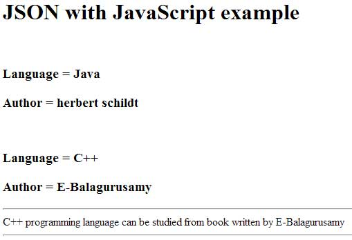

# JSON 概述

JSON 或者 JavaScript 对象表示法是一种轻量级的基于文本的开放标准，被设计用于可读的数据交换。约定使用 JSON 的程序员包括 C，C++，Java，Python，Perl 等等。

- JSON 是 JavaScript Object Notation 的缩写。
- 这个格式由 Douglas Crockford 提出。
- 被设计用于可读的数据交换。
- 它是从 JavaScript 脚本语言中演变而来。
- 文件名扩展是 __.json__。
- JSON 的网络媒体类型是 __application/json__。
- 统一标示符类型（Uniform Type Identifier）是 public.json。

## JSON 使用范围

- 用于编写基于 JavaScript 应用程序，包括浏览器扩展和网站。
- JSON 格式可以用于通过网络连接序列化和传输结构化数据。
- 主要用于在服务器和 Web 应用程序之间传输数据。
- Web 服务和 APIs 可以使用 JSON 格式提供公用数据。
- 还可以用于现代编程语言中。

## JSON 特点

- JSON 容易阅读和编写。
- 它是一种轻量级的基于文本的交换格式。
- 语言无关。

## JSON 简单示例

鉴于书籍数据有语言和版本信息，下面的例子展示了使用 JSON 存储书籍信息：

```
{
	"book": [
		{
			"id":"01",
			"language": "Java",
			"edition": "third",
			"author": "Herbert Schildt"
		},
		{
			"id":"07",
			"language": "C++",
			"edition": "second"
			"author": "E.Balagurusamy"
	}]
}
```

理解上述程序之后我们来看另外一个例子，让我们把下面的代码保存为 __json.htm__：

```
<html>
<head>
<title>JSON example</title>
<script language="javascript" >
  
	var object1 = { "language" : "Java", "author"  : "herbert schildt" };
	document.write("<h1>JSON with JavaScript example</h1>");
	document.write("<br>");
	document.write("<h3>Language = " + object1.language+"</h3>");  
	document.write("<h3>Author = " + object1.author+"</h3>");   

	var object2 = { "language" : "C++", "author"  : "E-Balagurusamy" };
	document.write("<br>");
	document.write("<h3>Language = " + object2.language+"</h3>");  
	document.write("<h3>Author = " + object2.author+"</h3>");   

	document.write("<hr />");
	document.write(object2.language + " programming language can be studied " +
	"from book written by " + object2.author);
	document.write("<hr />");
  
</script>
</head>
<body>
</body>
</html>
```

现在尝试使用 IE 或者其他任何启用了 JavaScript 的浏览器打开这个页面，它会生成如下所示结果：



你可以参考 [JSON 对象](objects.md) 来了解更多关于 JSON 对象的信息。